# BookVoyage - Airbnb Clone with MERN Stack

BookVoyage is a project built with the MERN (MongoDB, Express, React, Node.js) stack. It is a simplified version of Airbnb, featuring user registration and authentication, place management, and booking functionality.

## Table of Contents

- [Technologies Used](#technologies-used)
- [Features](#features)
- [Installation](#installation)
- [Usage](#usage)
- [Screenshots](#screenshots)
- [License](#license)
  
## Technologies Used
### Frontend

- **React:** JavaScript library for building user interfaces.
- **React Router Dom:** Declarative routing for React.js.
- **React Hook Form:** Library for managing forms in React.
- **Yup:** JavaScript schema builder for form validation.
- **Axios:** Promise-based HTTP client for making requests.
- **Leaflet:** Open-source JavaScript library for interactive maps.
- **React Leaflet:** React components for Leaflet maps.
- **Date-fns:** Modern JavaScript date utility library.
- **React Paginate:** A ReactJS component to render a pagination.

### Backend

- **Express:** Web application framework for Node.js.
- **Mongoose:** MongoDB object modeling for Node.js.
- **JWT (JSON Web Token):** JSON-based open standard for creating access tokens.
- **Multer:** Node.js middleware for handling multipart/form-data.
- **Cors:** Cross-Origin Resource Sharing middleware for Express.
- **Dotenv:** Zero-dependency module that loads environment variables.
- **Express Validator:** Middleware for request validation in Express.js.
- **Cookie Parser:** Middleware for parsing HTTP cookies.
- **Image Downloader:** Node.js library for downloading images from the internet.


## Features

1. **User Authentication:**
   - Register and log in users securely using JSON Web Tokens.

2. **User Profile:**
   - Allow users to view and edit their profile information.

3. **Place Management:**
   - Users can upload new places.
   - Users can edit information about their places.

4. **Booking Functionality:**
   - Users can book available places.
   - Users can view details of their bookings on a dedicated page.

5. **Search Functionality:**
   - Search for available places based on destination, dates, and the number of guests.

6. **Homepage:**
   - Display all uploaded places on the homepage.

7. **Place Page:**
   - View detailed information about each uploaded place.

## Installation

1. **Clone the repository:**

   ```bash
   git clone https://github.com/HristiyanaDanailova/BookVoyage.git

2. **Navigate to the project directory:**

   ```
   cd BookVoyage
   ```
   
3. **Install dependencies:**
 
   Run the following command in both the /server and the /client folders

   ```
   npm install
   ```

4. **Configure the .env file in /server**
   
   Create a new **.env** file in the server directory.
   Add your MongoDB connection string and any other environment variables required for the server. You can use the env-example.txt file in the server directory for    reference

5. **Run**

   Run the following command in /client
   
   ```
   npm start
   ```

   Run the following command in /server

   ```
   node index
   ```
   
## Usage

1. Open your browser and navigate to [http://localhost:3000](http://localhost:3000).

2. Register or log in to start using BookVoyage.

3. Explore places, book your desired destination, and manage your bookings.

## Screenshots

### 1. User Registration/Login
#### Register page
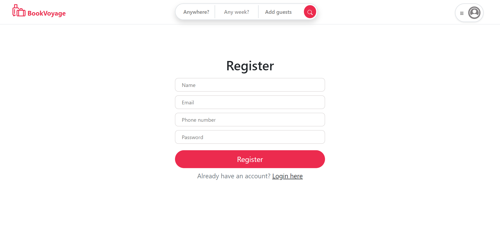
#### Login page
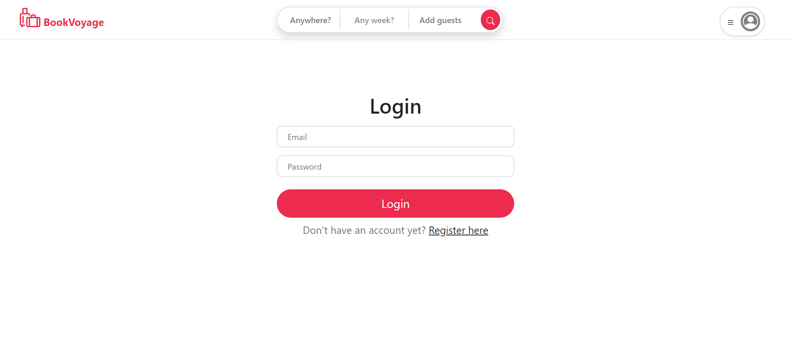

### 2. User profile
#### Default profile page
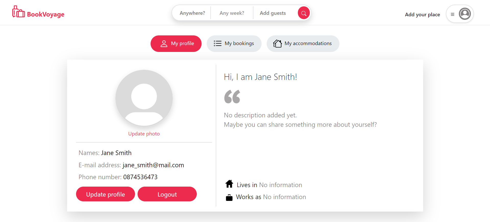
#### Edit profile modal
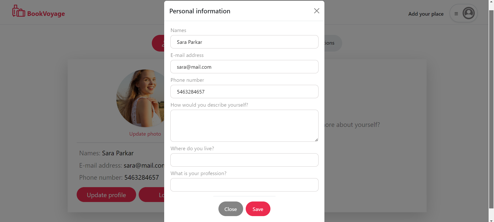
#### Edited profile page
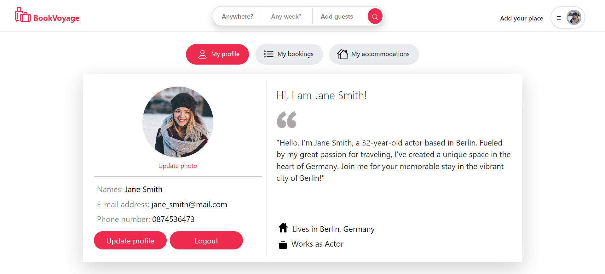
#### User places page

#### User bookings page
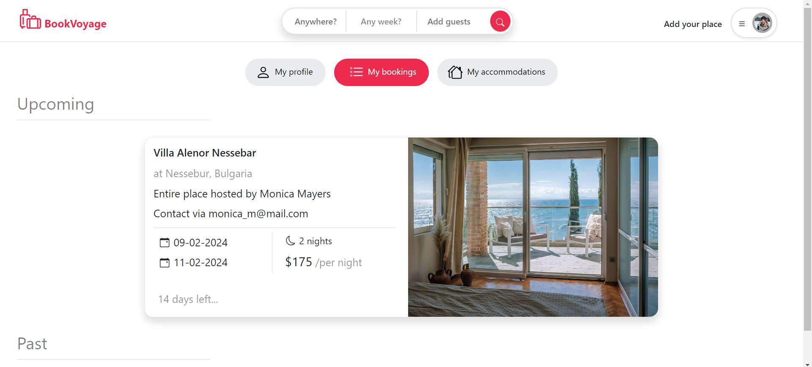

### 3.Places
#### Add place page
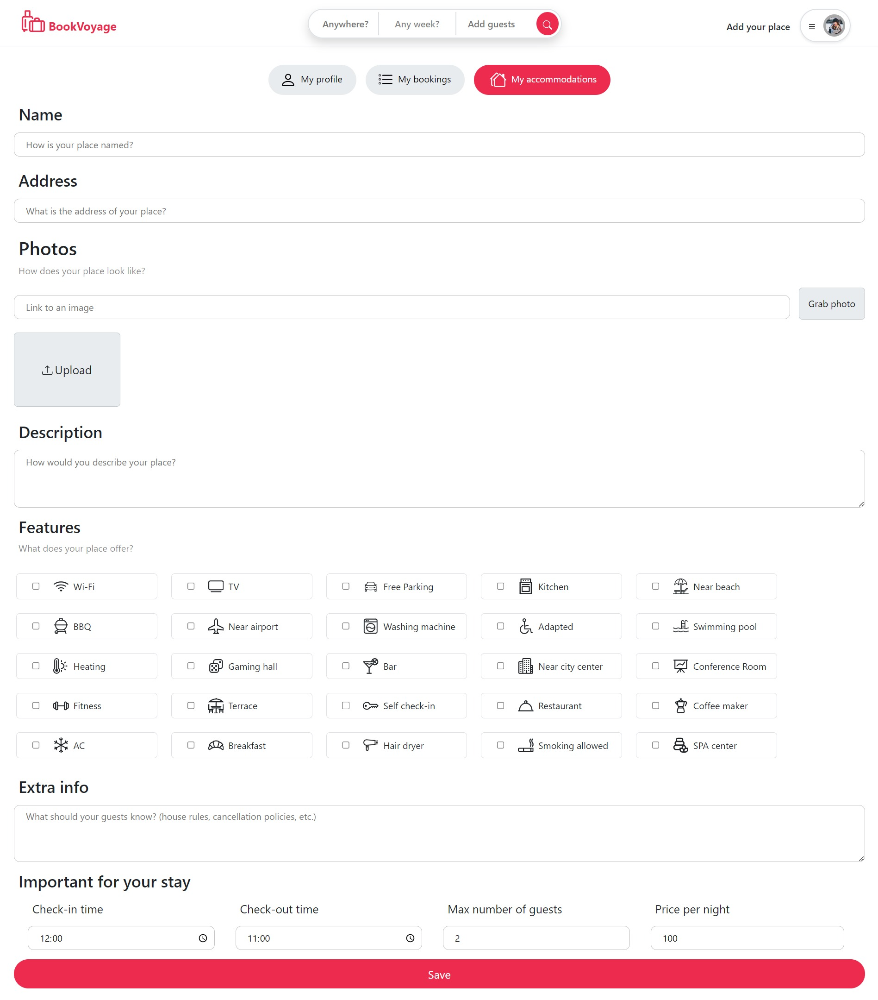
#### Edit place page
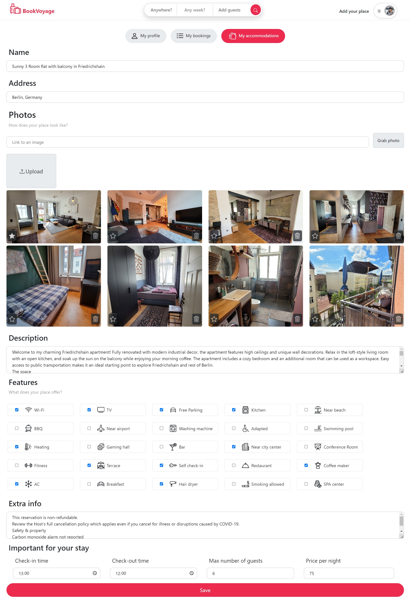
#### Place page
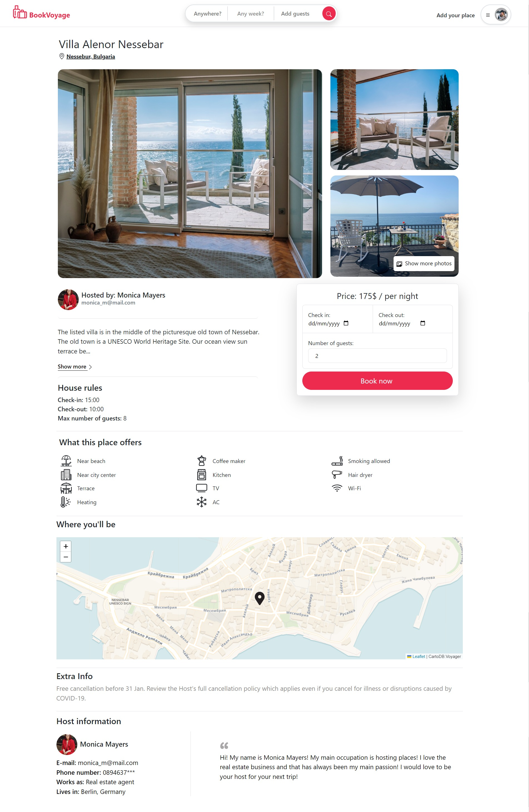

### 4. Bookings
#### Book place form
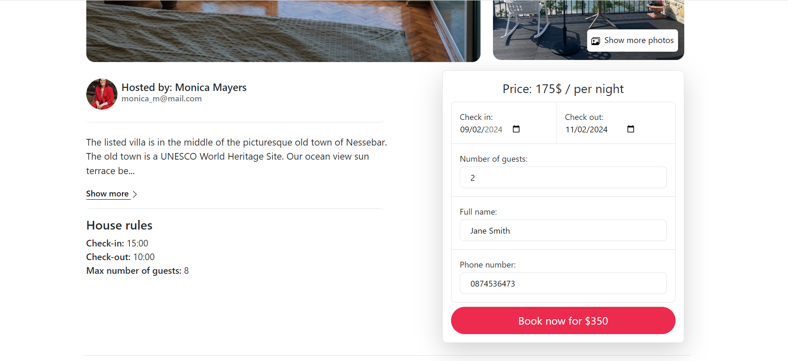
#### Booking page
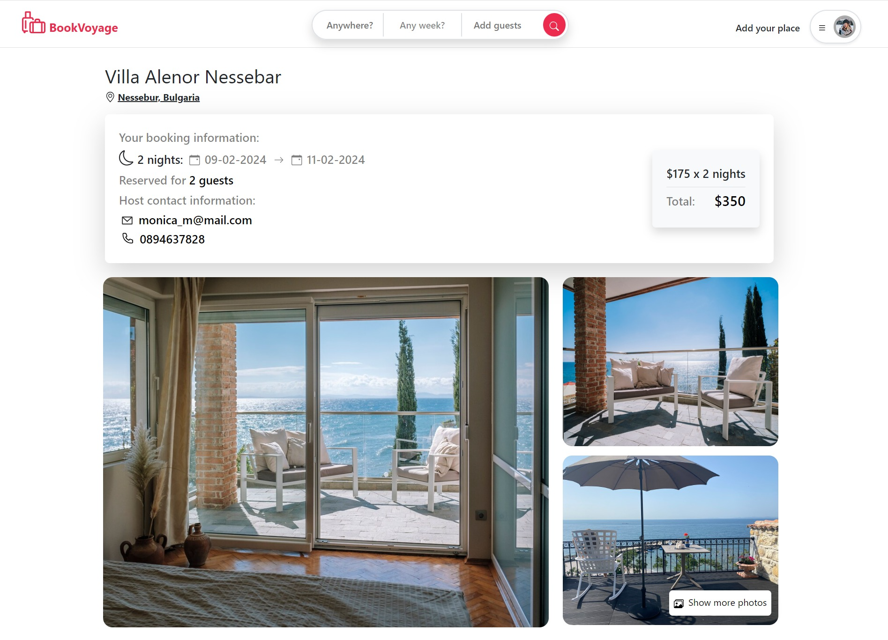

### 5. Home page
#### Home page
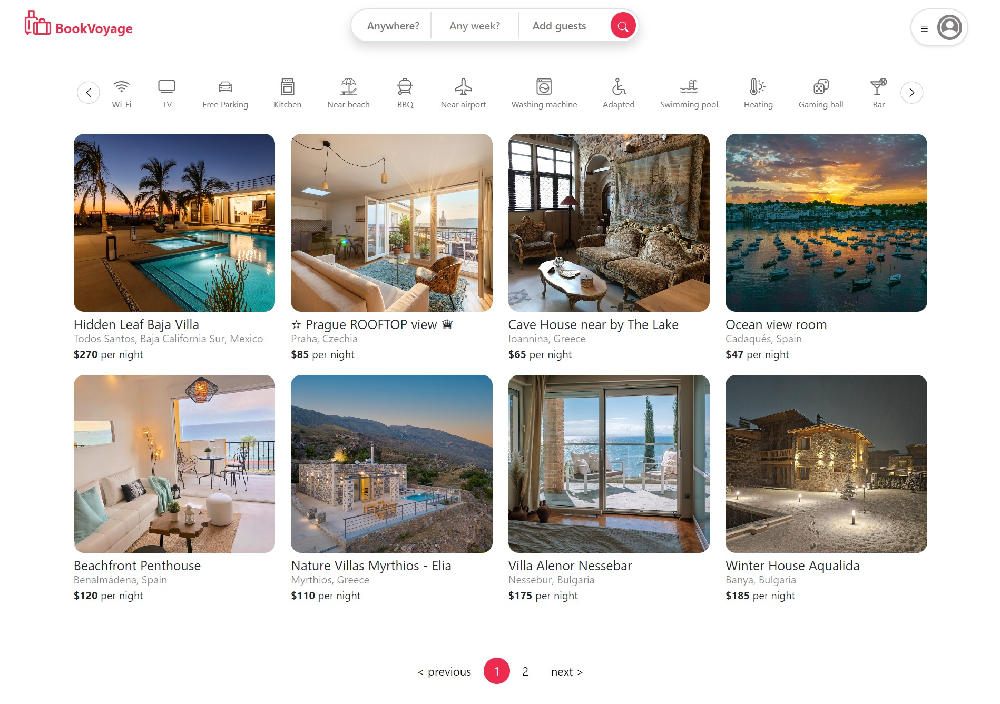
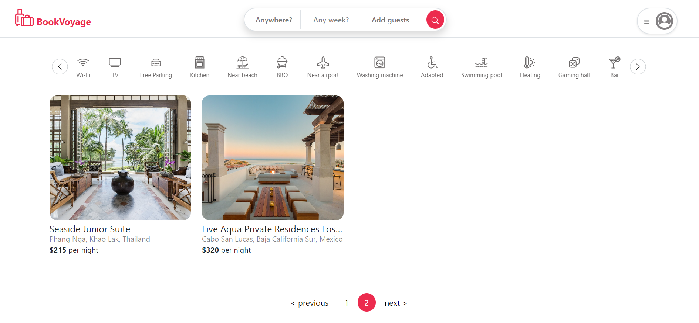
#### Search by feature
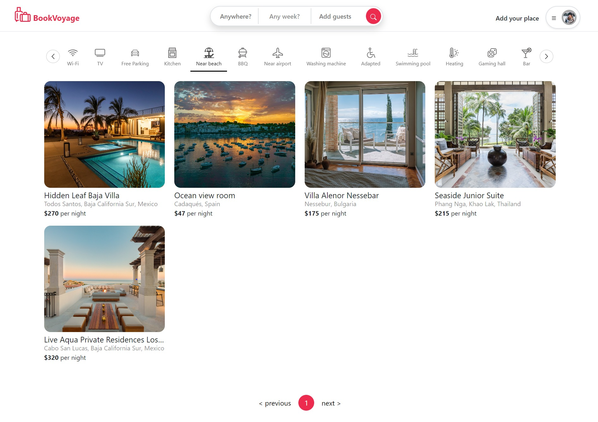
#### Search by destination and number of guests
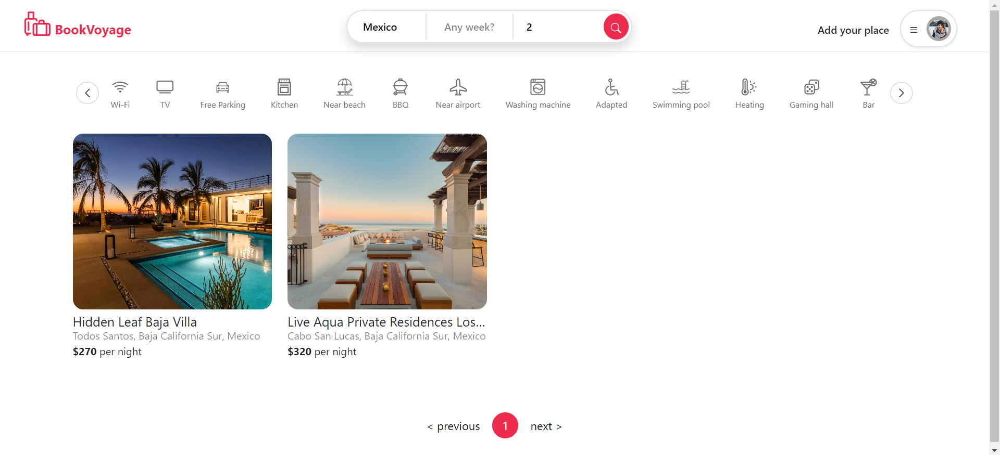
#### Search by destination
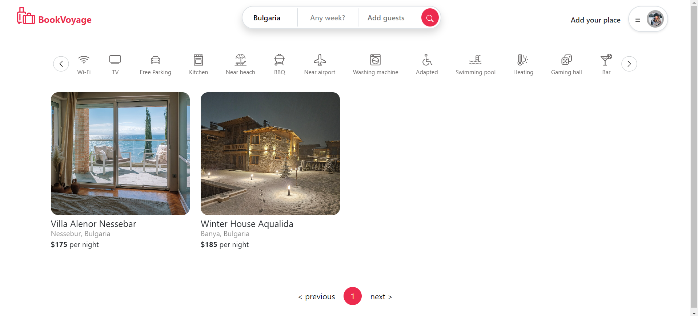
#### Search by destination and dates
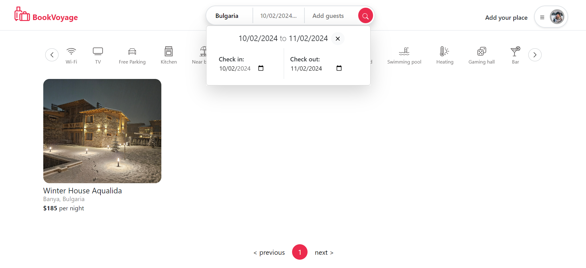
#### No result search
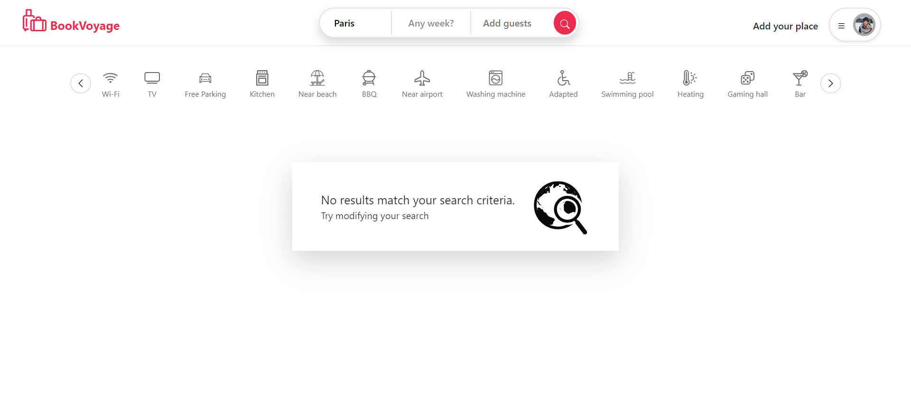
#### Invalid URL page


## License

This project is licensed under the [MIT License](LICENSE).
